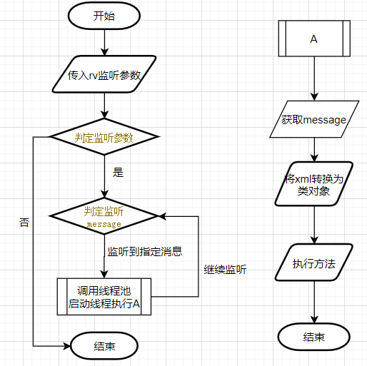
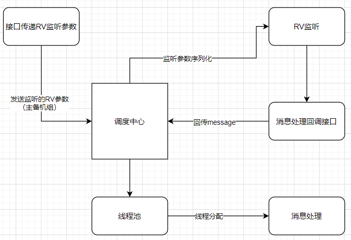
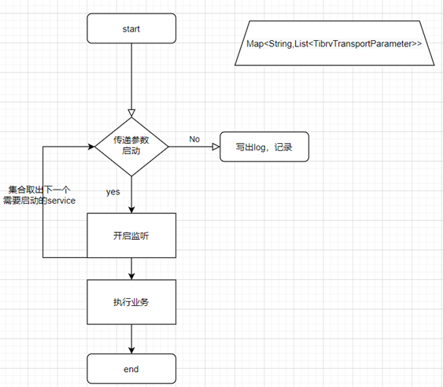
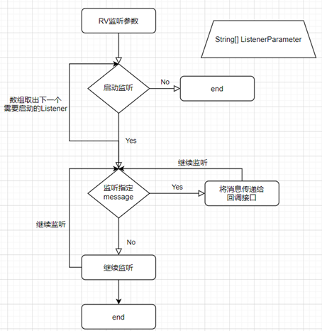
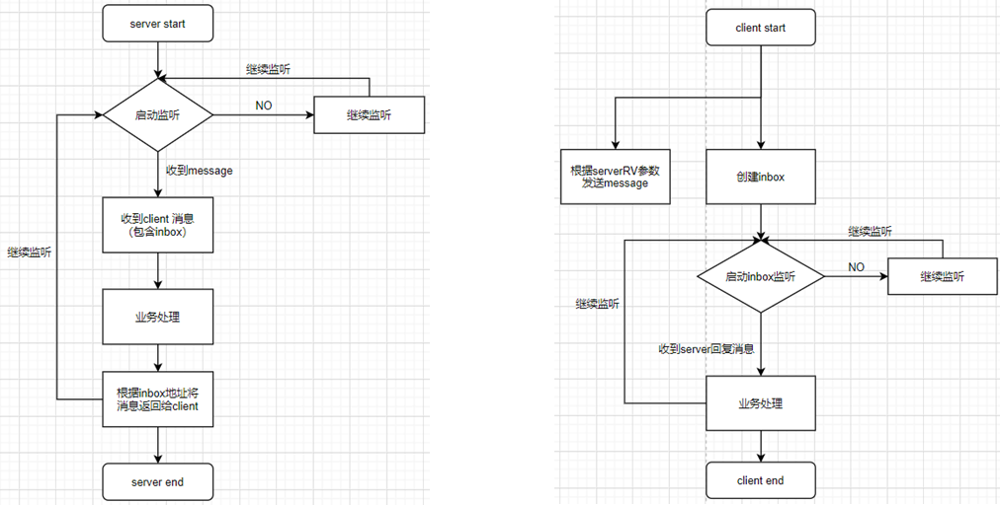
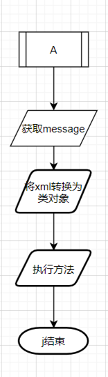
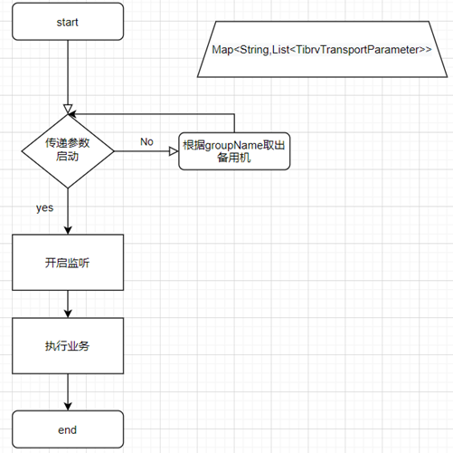
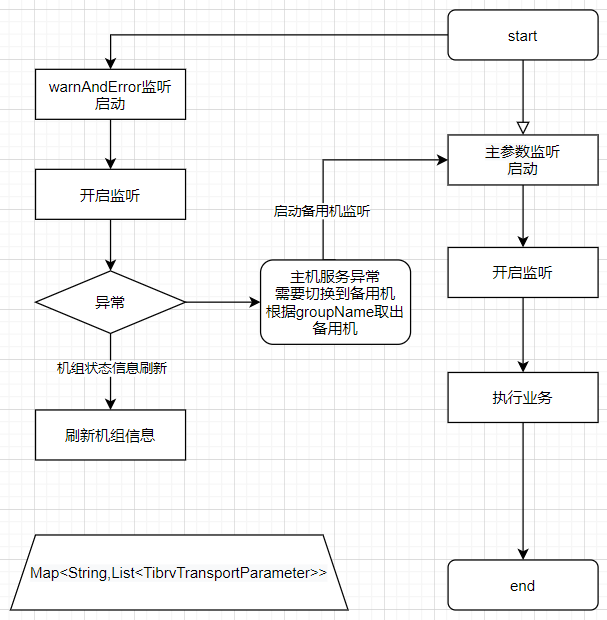

# rvListerDemo

### 这是一个 Tibco RV 的发送消息和接收消息的实例

#### 实现监听rv发送的message，监听到后将message中的xml转为对象

   1. 启动多个TibrvTransport  和TibrvListener,监听多个service
   2. 启动TibrvTransport时server判断是否有正常工作，如果没有，则启动备用监听
   3. 创建inbox启用监听
   4. runtime()显示当前进程的内存大小，启动线程池分配线程执行消息处理。

         #### RV 消息监听流程

#### RV 消息监听处理架构图

#### RV 消息监听 –监听不同的service

在需要监听多个service时，只需要将参数保存到集合里，遍历创建不同的TibrvTransport
和对应的TibrvListener即可

#### RV 消息监听 –多个subjectName

RV监听是在指定RV的service，network，deason，和指定的subjectName(可以多个)进行监听

#### RV 消息监听 –inbox

inbox监听是在指定RV的service，network，deason后，指定点对点的进行 server –client通信
在RV中，主要是通过创建inbox(唯一的通信地址)来实现监听

#### RV 消息处理

将消息进行筛选后，使用Xstram 将类转换为对象，并输出

#### RV 消息监听 –静态主备机制

在创建TibrvTransport时，会检测是否能够创建主机是否正常。
方法 TibrvTransport.isValid（）会返回主机的工作状态，如果主机没有打开，那么就启动备用机

#### 监听系统通知 –动态主备机制

主备切换即是在主机收不到消息或者主机关闭时，能够切换到备用机上继续监听消息，实现服务的连续性。实现主备切换的重点在于对于rv的守护进程（daemon）的监听
，在daemon发送错误信息时，根据信息情况，自动切换到备用机上
在rv消息接收过程中，如果发送端在发送完成或者在发送过程中被关闭，守护进程会在相应的——RV.*频道进行广播告知接收端。基于此机制，可以进行监听RV系统频道。
如果守护进程（daemon）出现发送异常信息，那么就可以根据相应的信息进行主备切换或者刷新备用机的状态信息

